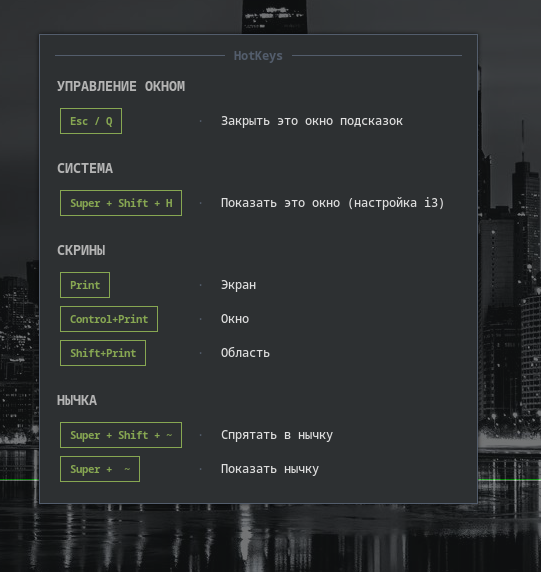
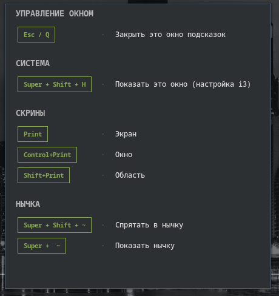

# HotkeyHelper (v0.0.1) 🐧⌨️

## Screenshots
[](screenshots/01.png) [](screenshots/02.png)

[English](#english) | [Русский](#русский)

---

## English

A lightweight and fast Python / Tkinter utility that displays a cheat sheet of your custom hotkeys. It is designed with tiling window managers in mind (i3wm, sway, bspwm, etc.) as it automatically opens as a centered, floating window.

### Features
- **Adaptive Size**: The window adjusts to the text length but never exceeds 50% of the screen.
- **Keyboard Navigation**: Close with `Esc` or `Q`/`q`. Scroll through long lists using Arrow keys, `PageUp`/`PageDown`, `Home`, and `End`.
- **Fully Customizable**: Themes and hotkey lists are separated into independent JSON files.

### Installation & Run

1. Clone the repository:
   ```bash
   git clone https://github.com/1mesles1/hotkeyhelper
   cd hotkeyhelper
   ```
2. Run the application:
   ```bash
   python main.py
   ```
### Arch Linux Installation (via PKGBUILD)
If you are on Arch Linux, you can build and install the application as a native package using `makepkg`:
```bash
git clone https://github.com/1mesles1/hotkeyhelper
cd hotkeyhelper
makepkg -si
```
This will compile the package, resolve dependencies, install the global `hotkeyhelper` command, and place the documentation inside `/usr/share/doc/hotkeyhelper/`.

### Configuration

- **Hotkeys (`hotkeys.txt`)**: Add your combinations and descriptions in JSON format.
- **Theme (`config.json`)**: Change colors, font families, and sizes to match your system look.

### i3wm Integration
To open the helper using a global shortcut, add the following line to your `~/.config/i3/config`:
```text
bindsym $mod+Shift+h exec --no-startup-id python /path/to/hotkeyhelper/main.py
```

---

## Русский

Легковесная и быстрая утилита на Python / Tkinter для вывода подсказок по горячим клавишам. Программа создавалась с прицелом на тайлинговые оконные менеджеры (i3wm, sway, bspwm и др.), так как она автоматически открывается в режиме плавающего (floating) окна по центру экрана.

### Особенности
- **Динамический размер**: Окно подстраивается под количество текста, но никогда не превышает 50% экрана.
- **Управление с клавиатуры**: Закрытие по нажатию `Esc` или `Q`/`q`. Прокрутка длинных списков стрелками, `PageUp`/`PageDown`, а также `Home`/`End`.
- **Полная кастомизация**: Цветовые темы и списки клавиш вынесены в отдельные, удобные для редактирования JSON-файлы.

### Установка и запуск

1. Клонируйте репозиторий:
   ```bash
   git clone https://github.com/1mesles1/hotkeyhelper
   cd hotkeyhelper
   ```
2. Запустите программу:
   ```bash
   python main.py
   ```
### Установка в Arch Linux (через PKGBUILD)
Если вы используете Arch Linux, вы можете собрать и установить утилиту как родной системный пакет с помощью утилиты `makepkg`:
```bash
git clone https://github.com/1mesles1/hotkeyhelper
cd hotkeyhelper
makepkg -si
```
Эта команда соберет пакет, установит глобальную команду `hotkeyhelper` в систему и положит сопутствующую документацию в каталог `/usr/share/doc/hotkeyhelper/`.

### Конфигурация

- **Список клавиш (`hotkeys.txt`)**: Добавляйте свои комбинации и описания в структуру JSON.
- **Настройки темы (`config.json`)**: Настраивайте цвета, шрифты и размеры под вашу системную тему.

### Интеграция с i3wm
Чтобы вызывать подсказку по нажатию глобального сочетания клавиш, добавьте в ваш `~/.config/i3/config`:
```text
bindsym $mod+Shift+h exec --no-startup-id python /путь/к/папке/hotkeyhelper/main.py
```

